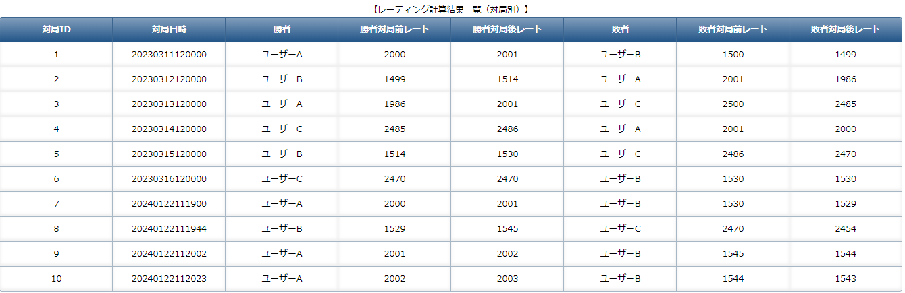

# 将棋の対局結果管理・レーティング計算アプリケーション
rateKeeperは、将棋の対局結果を管理するアプリケーションです。 
対局記録はQRコードから読み取り、自動的にデータベースに登録します。 
また、登録した対局記録をもとにレーティング計算を行う機能も実装しています。  

# 本アプリケーションの作成背景
知人がプログラミング学習をしたいとの要望あり、作成したアプリケーションになります。 
JavaやSpringBootを利用したWEBアプリケーションを学ぶにあたり、SpringBootを用いた 
基本的な3層モデルや、データベースに対するCRUD操作を機能として盛り込んでいます。 
また知人の興味があったQRコードの読み取り機能や、レーティング計算機能を実装しています。 

# 機能一覧

本アプリケーションで提供する機能は下記の通りです。

1. QRコード読み取り
1. 対局結果管理（CRUD）
1. 会員情報管理（CRUD）
1. レーティング計算
1. QRコード表示

## 1.QRコード読み取り

- 本画面を開いた状態でQRコードを読み取ると、対局の勝敗結果が自動でデータベースに登録されます。 
QRコードには対局者のIDを付与したURLを含めておきます。 
まず先に勝者側のQRコードを読み取り、次に敗者側のQRコードを読み取って登録します。 

  

 

## 2.対局結果管理
- 対局結果管理機能として、対局結果の検索機能、個別登録・編集機能、一括登録機能（CSV読み込み）を提供します。

### 対局結果の検索

### 対局結果の個別登録

### 対局結果の編集

### 対局結果の一括登録（CSV読み込み）

## 3.会員情報管理
- 会員情報管理機能として、会員の検索機能、個別登録・編集機能、一括登録機能（CSV読み込み）を提供します。

### 会員情報の検索

### 会員情報の個別登録

### 会員情報の編集

### 会員情報の一括登録（CSV読み込み）

## 4.レーティング計算
- 対局結果をもとに、レーティング計算を行います。会員別のレーティング増減および、対局別での計算結果を表示します。 

## 5.QRコード表示
- 会員を指定して、QRコードを表示させる機能です。 
※このQRコードを対局票に添付させ、PDF出力すれば完成ですが、そこまでは実装しませんでした。 

## その他
- メインメニュー

- サイドメニュー

# 使用技術

## フロントエンド
- HTML
- CSS
- JavaScript
- JQuery
- Thymeleaf

## バックエンド
- Java 17
- SpringBoot 2.7.8
- MySQL 8.0.17
- zxing 3.4.1
- opencsv 5.5.2

## その他（開発ツールなど）
- Docker（開発環境におけるDBのコンテナとして利用）
- POM
- Git
- Eclipse Version: 2023-03 (4.27.0)
- A5:SQL Mk-2
